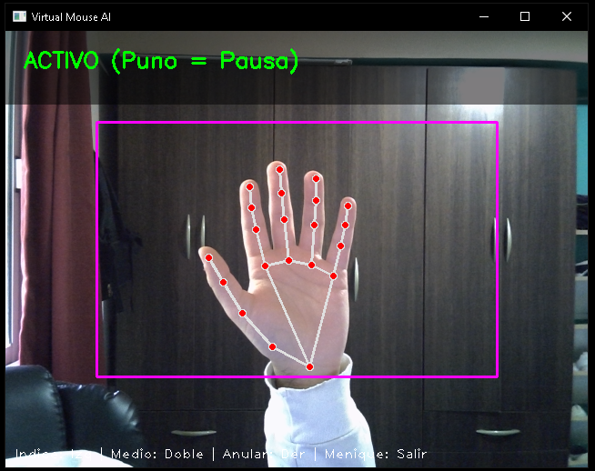
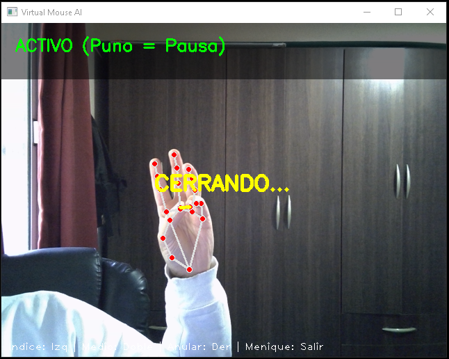

# 🖱️ AI Virtual Mouse | Computer Vision Control

> **Control total de tu PC sin tocar el mouse, utilizando el poder de la Visión Artificial.**


## 📖 Sobre el Proyecto

Este proyecto nació de la necesidad de controlar interfaces multimedia a distancia. Utilizando una cámara web estándar y algoritmos de **Deep Learning** (MediaPipe), el sistema detecta los "landmarks" de la mano en tiempo real y mapea gestos naturales a funciones del sistema operativo.

El resultado es un **Mouse Virtual** fluido, con estabilización de movimiento (algoritmos de suavizado) y un sistema de gestos ergonómicos para clics y control de estado.

---

## 🎮 Demo y Funcionalidades
Demo de la aplicación:



Demo de la aplicación en ejecución:




### 🤖 Guía de Gestos (Ergonomía de Mano Completa)

El sistema utiliza una lógica de "pellizcos" (pinch) para simular los clics, asignando cada acción a un dedo para maximizar la naturalidad:

| Gesto | Acción | Feedback Visual |
| :--- | :--- | :--- |
| **👆 Índice Arriba** | **Mover Cursor** | Recuadro Violeta (ROI) |
| **🤏 Índice + Pulgar** | **Clic Izquierdo** | 🟢 Círculo Verde |
| **🤏 Medio + Pulgar** | **Doble Clic** | 🟠 Círculo Naranja |
| **🤏 Anular + Pulgar** | **Clic Derecho** | 🔴 Círculo Rojo |
| **🤙 Meñique + Pulgar**| **Cerrar Aplicación** | 🟡 Línea Amarilla |
| **✊ Puño Cerrado** | **Pausar Tracking** | Texto de Estado |

---

## 🛠️ Tecnologías Implementadas

* **OpenCV:** Procesamiento de imagen y renderizado de la interfaz (UI) tipo "Heads-Up Display".
* **MediaPipe Hands:** Detección de 21 puntos clave de la mano con inferencia en tiempo real.
* **PyAutoGUI:** Interfaz de automatización para el control del hardware (mouse/teclado).
* **Numpy:** Cálculos matemáticos para la interpolación de coordenadas y suavizado de movimiento.

## 🚀 Instalación y Uso

### Opción 1: Ejecutable (Windows)
Descarga el archivo `.exe` desde la sección de [Releases](link-a-tus-releases) y ejecútalo. No requiere instalación.

### Opción 2: Correr desde el código

1. Clonar el repositorio:

    ```bash
    git clone https://github.com/Nahuelito22/Virtual_Mouse
    ```

2. Instalar dependencias:

    ```bash
    pip install -r requirements.txt
    ```

3. Ejecutar:
    ```bash
    python virtual_mouse.py
    ```

### 🧠 Desafíos Técnicos Superados
1. Jitter (Temblor): Se implementó un algoritmo de suavizado para evitar que el cursor tiemble debido a la micro-fluctuación de la detección de la cámara.

2. Mapeo de Coordenadas: Se creó una "Zona de Interés" (ROI) reducida para permitir alcanzar las esquinas de la pantalla sin necesidad de estirar el brazo fuera del campo de visión.

3. Gestión de Estados: Implementación de modos "Activo" y "Pausa" para evitar interacciones accidentales.

--- 
Hecho con 🐍 y mucha curiosidad por [Nahuel Ghilardi](https://nahuel-portfolio.vercel.app/#).