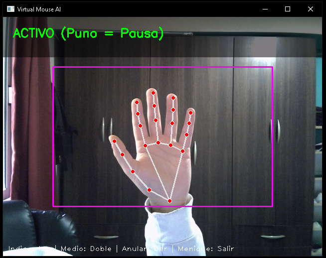
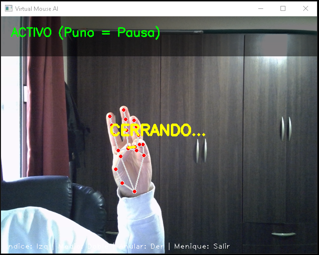

# AI Virtual Mouse

Controla el cursor de Windows con gestos de la mano, usando la webcam y visión artificial (MediaPipe + OpenCV).


## Demo





## Gestos

| Gesto | Acción | Feedback |
| :--- | :--- | :--- |
| **Índice arriba** | Mover cursor | ROI violeta |
| **Pulgar + índice** (toque corto) | Clic izquierdo | Círculo verde |
| **Pulgar + índice** (mantener) | Arrastrar (drag) | Modo DRAG |
| **Pulgar + medio** | Doble clic | Círculo naranja |
| **Pulgar + anular** | Clic derecho | Círculo rojo |
| **Índice + medio** arriba | Scroll vertical | Línea scroll |
| **Pulgar + meñique** (mantener) | Cerrar app | Barra de progreso |
| **Puño cerrado** | Pausar | Estado PAUSADO |
| **Mano abierta** | Reanudar | Estado ACTIVO |

### Teclas

| Tecla | Acción |
| :--- | :--- |
| `Q` / `Esc` | Salir |
| `C` | Cambiar cámara (selector visual) |
| `H` | Mostrar / ocultar ayuda |
| `L` | Mostrar / ocultar landmarks |
| `+` / `-` | Ajustar suavizado del cursor |

## Inicio rápido

### Opción A — Ejecutable (Windows)

1. Compila localmente (recomendado):

```powershell
.\build.ps1
```

El `.exe` queda en `Release\AI_Virtual_Mouse.exe`.

2. O usa el launcher:

```bat
run.bat
```

(`run.bat` prioriza el `.exe` si existe; si no, corre con Python.)

### Opción B — Desde código

```bash
git clone https://github.com/Nahuelito22/Virtual_Mouse.git
cd Virtual_Mouse

python -m venv venv
# Windows:
venv\Scripts\activate
# Linux/macOS:
# source venv/bin/activate

pip install -r requirements.txt
python virtual_mouse.py
```

### Elegir cámara (webcam vs celular)

Si tenés más de una cámara (p. ej. webcam + iPhone/Phone Link/DroidCam), el índice `0` a veces es la del celular.

```bash
# Ver camaras detectadas
python virtual_mouse.py --list-cameras

# Selector visual (vista previa en vivo)
python virtual_mouse.py --pick-camera

# Usar un indice concreto (ej. webcam en 1)
python virtual_mouse.py -c 1
```

Durante la app, tecla **`C`** abre el selector otra vez. La elección se guarda en `~/.virtual_mouse/config.json`.

### Argumentos opcionales

```bash
python virtual_mouse.py --camera 0 --smooth 6 --pinch 35
python virtual_mouse.py --no-help
```

| Flag | Descripción | Default |
| :--- | :--- | :--- |
| `-c` / `--camera` | Índice de webcam | guardada / selector |
| `--list-cameras` | Lista cámaras y sale | — |
| `--pick-camera` | Selector visual al inicio | auto si hay varias |
| `--width` / `--height` | Resolución de captura | `640` / `480` |
| `--smooth` | Suavizado del cursor (1–20) | `5` |
| `--pinch` | Umbral de pellizco (px) | `35` |
| `--no-help` | Oculta el panel de ayuda al inicio | off |

## Requisitos

- Windows 10/11 (el control del mouse está pensado para escritorio Windows)
- Webcam
- Python 3.10–3.12 recomendado
- Buena iluminación de la mano

## Mejoras técnicas

- **Debounce / cooldowns** en clics para evitar spam de eventos
- **Drag & drop** manteniendo el pellizco izquierdo
- **Scroll** con índice + medio
- **Salida segura** con hold + progreso (evita cierres accidentales)
- **Detección de mano** (izquierda/derecha) para el pulgar
- **UI** con FPS, modo actual y panel de ayuda
- **Suavizado** configurable en caliente (`+` / `-`)
- **Manejo de errores** de cámara y limpieza de recursos
- **Empaquetado** a `.exe` con `build.ps1` (PyInstaller)

## Estructura

```
Virtual_Mouse/
├── virtual_mouse.py      # App principal
├── requirements.txt
├── build.ps1             # Genera Release/AI_Virtual_Mouse.exe
├── run.bat               # Launcher rápido
├── AI_Virtual_Mouse.spec # Spec PyInstaller (regenerable)
├── assets/               # Capturas para el README
└── README.md
```

## Notas de uso

1. Arranca en **PAUSADO**: abre la mano completa para activar.
2. Mantén la mano dentro del recuadro ROI para alcanzar bien las esquinas.
3. Si el cursor tiembla, sube el suavizado con `+`.
4. Si los clics no registran, acerca un poco más el pellizco o baja `--pinch`.
5. Cierra con `Q`, o manteniendo pulgar + meñique.

## Licencia

MIT — ver [LICENSE](LICENSE).

---

Hecho con Python y curiosidad por [Nahuel Ghilardi](https://nahuel-portfolio.vercel.app/#).
